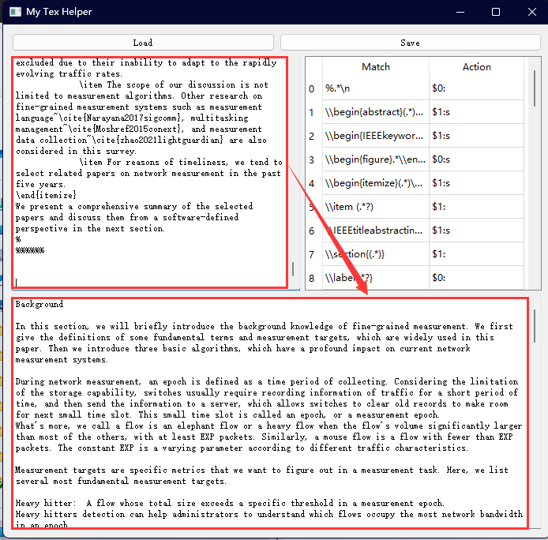

# Tex2text

A useless tool that translates a command-oriented tex file to a pure text file. The underlying principle is very simple: using regular expression to replace the commandes to spaces.

## Get Started

You can download and run the [executable binary file](https://github.com/mmhzheng/Tex2text/releases/tag/v0.2-alpha).

1. Load a configure file with replacing rules. Here I give a [example configre file](./config_2022_08_31_22_05.txt).


2. Check or Edit your rules. 


```
%.*\n -> $0:
\\begin{abstract}(.*)\\end{abstract} -> $1:s
\\begin{IEEEkeywords}(.*)\\end{IEEEkeywords} -> $1:s
\\begin{figure}.*\\end{figure} -> $0:s
\\begin{itemize}(.*)\\end{itemize} -> $1:s
\$.*?\$ -> EXP:
\\S -> this Section:
...
```

The rules include two parts : a left part and a right part, divided by an arrow mark '->'. The left part is a normal regular expression.
The right part is a self-defined mark: `new_text:flag`.
There are three types of `new_text`:
* `$0` represents spaces, which means erasing all matched text.
* `$1` represents original text, which use the reserved text in the regular expression wrapped in brackets.
* `OTHER_TEXT` like `EXP` and `this Section`, represents replacing all matched text with the `OTHER_TEXT`.

The flag is the flag of regular expression. Currently, `g` is enabled by default, `s` means enabling match `\n`, which are used in multi-row matching. 


3. Input your tex documents and get the result.



You can also edit your configure file if you are familiar with the regular expressions. Then you can click save to convert them into a file.

